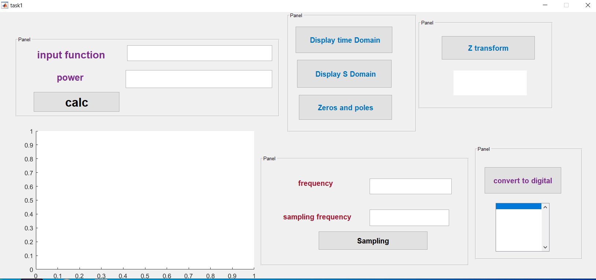
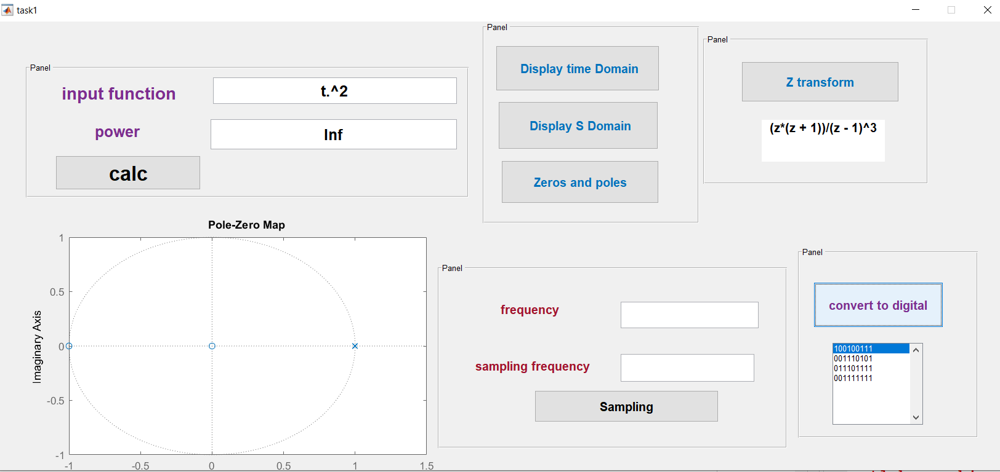
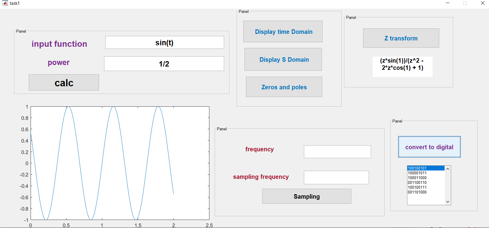

# MATLAB-_GUI
Designing a MATLAB GUI that allows us to deal with an input signal and do some operations on like displaying it in time domain, calculating the power, finding Laplace transform, Z transform and Finding the equivalent Digital code of the signal   

